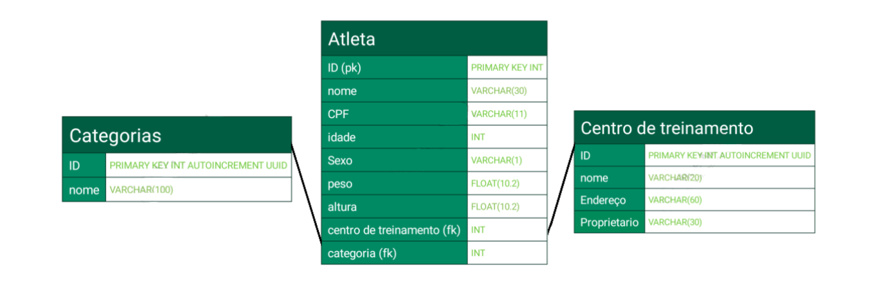

# Workout API

> **Adendo:** Este projeto foi desenvolvido durante o bootcamp de Python Backend Development oferecido pela DIO (digital innovation one.) em parceria com a Vivo.

[repositório DIO](https://github.com/digitalinnovationone/workout_api)

Esta é uma API de competição de crossfit chamada WorkoutAPI. É uma API pequena, devido a ser um projeto mais hands-on e simplificado nós desenvolveremos uma API de poucas tabelas, mas com o necessário para você aprender como utilizar o FastAPI.

## O que é o FastAPI?

O FastAPI é um framework Python para desenvolvimento de APIs. É um framework moderno, rápido e simples, baseado nos type hints padrões do Python. O FastAPI foi lançado em novembro de 2018 e é considerado um dos melhores frameworks de código aberto de 2021.

**fonte:** [treinaweb/blog/o-que-e-fastapi](https://www.treinaweb.com.br/blog/o-que-e-fastapi)


## Sobre o projeto:

A API foi desenvolvida utilizando o fastapi, junto das seguintes libs: alembic, SQLAlchemy, pydantic. Para salvar os dados duranto o bootcamp é utilizado o Postgres porém optei por usar sqlite3 por questões de práticidade.


### Modelagem de entidade e relacionamento - MER



### Para instalar:

Instalando as dependências do projeto

```shell
pip install -r requirements.txt
```

Para criar o banco de dados, execute:

```shell
make run-migrations
```

Para criar uma migration nova, execute:

```shell
make revision d="nome_da_migration"
```

Para subir a API, execute:

```shell
make run
```
e acesse: http://127.0.0.1:8000/docs